# **Build a contact center for booking and checking appointment with AWS Connect/Lex/Lambda**

## **Overview**
In this lab we, you will be building a contact center using Amazon Connect and integrating with Amazon Lex. Amazon Lex interprets dual-tone multi-frequency signaling (DTMF) digits entered on a keypad. It matches the intent based on that input in the same way it matches the intent when you speak an utterance. This provides for greater flexibility for customers to interact with your contact center. 

## **Architecture**
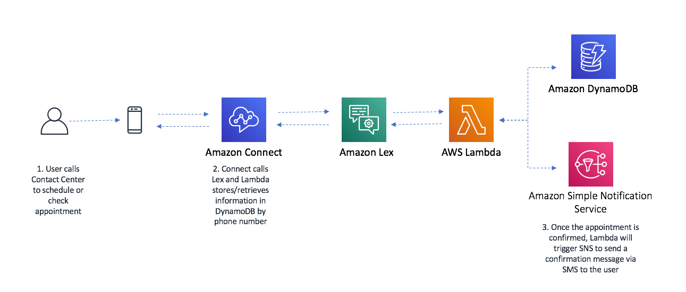

## **Walkthrough**
1. [Create Lex Chat Bot](#CreateLexChatBot)
2. [Create Amazon Connect Instance](#CreateAmazonConnect#)
3. [Amazon Connect Lex Integration](#integration)

### **Create Lex Chat Bot **

1.	Open the Amazon Lex Console in N.Virginia Region at https://console.aws.amazon.com/lex/home?region=us-east-1#
2.	On the Bots page, choose **Create**

3.	Create a **‘Custom bot’**.
Name the Bot as **BookAppointment**
Complete other fields as specificed in the picture below and choose **Create**.

#### **Create BookAppointment Intent** - Action user wants to perform
1.	Choose **Create Intent**. Name the intent as **BookAppointment**

2.	Create Utterances - Spoken or typed phrases that will invoke our intent as shown in the picture
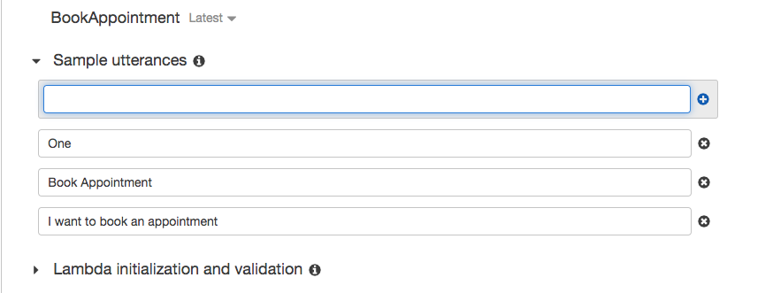

3.	Set initialization and validation function

1. Adding Slots - Parameters required to fulfil the intent.
Configure the slots as follows:
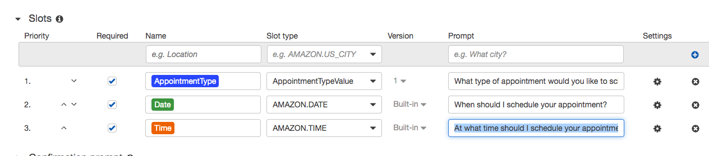

5. Set Fulfillment function

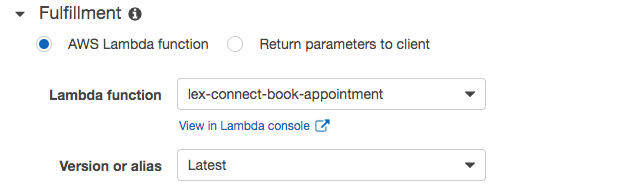

#### **Create CheckAppointment Intent**
1.	Choose to **Add Intents**. Name intent as CheckAppointment
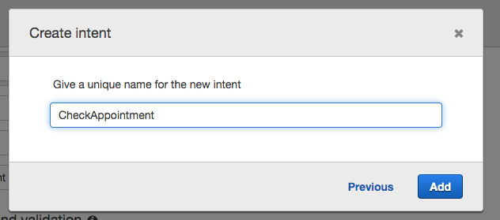

1. Create Utterances - Spoken or typed phrases that will invoke our intent
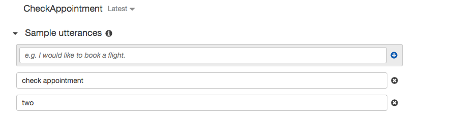

3.	Set Fulfillment function

#### Build and Publish Lex Bot ####
Build and Publish the Bot. Choose Alias as BookAppointment.
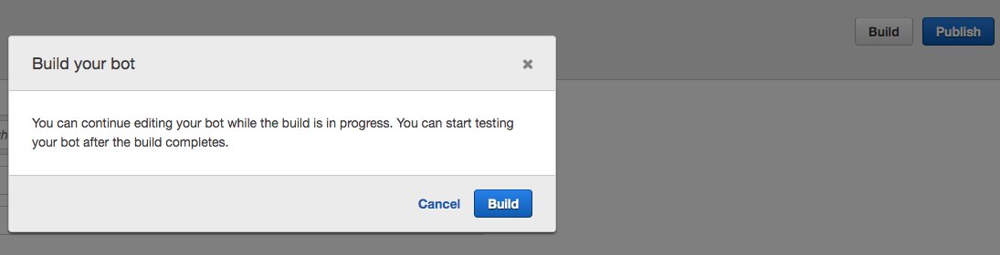
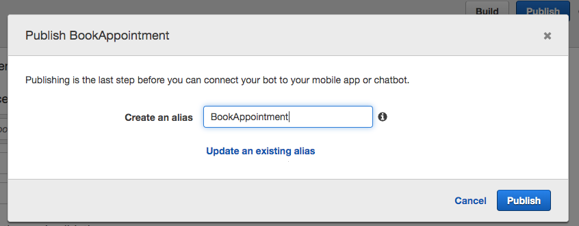

### Create Amazon Connect Instance 
For the simplicity of this lab, we created a Connect instance in **Sydney Region** for you. You can find the Connect instance at https://ap-southeast-2.console.aws.amazon.com/connect/home?region=ap-southeast-2
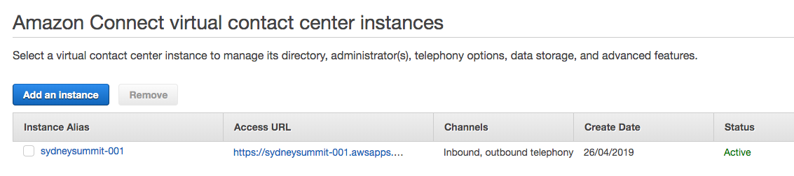

Click on the **Instance Alias**

### Integrate Amazon Connect and Lex 
#### Add the Amazon Lex bot to Amazon Connect Instance
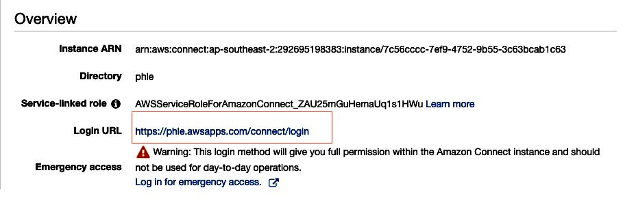

#### Create a contact flow and add your Amazon Lex bot
1.	Log in to your Amazon Connect instance
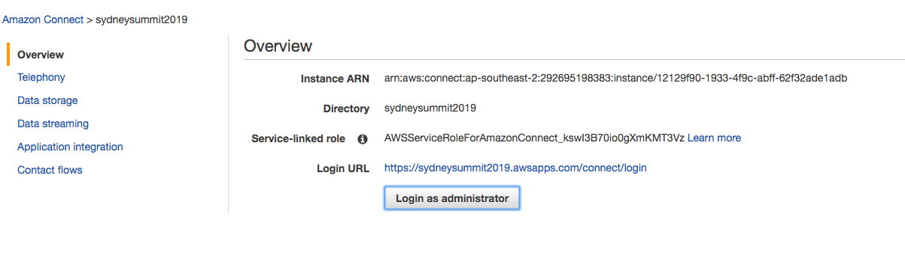

2. Choose **Routing -> Contact flows -> Create contact flow**, and type a **SydneySummitContactFlow**
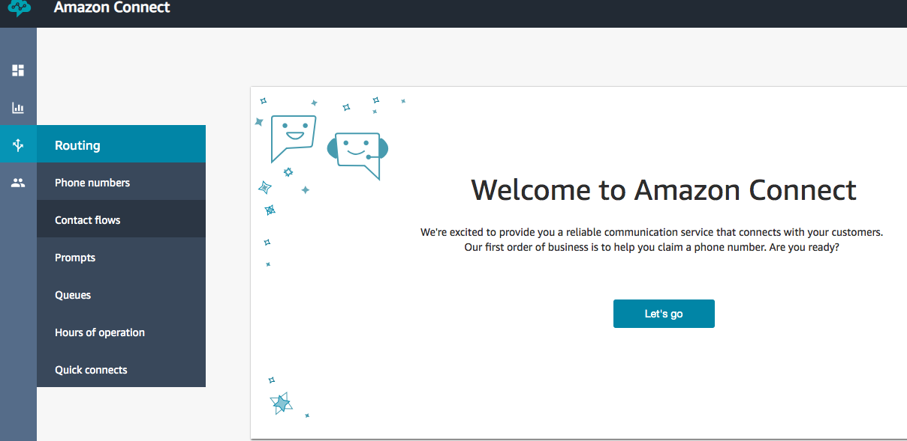
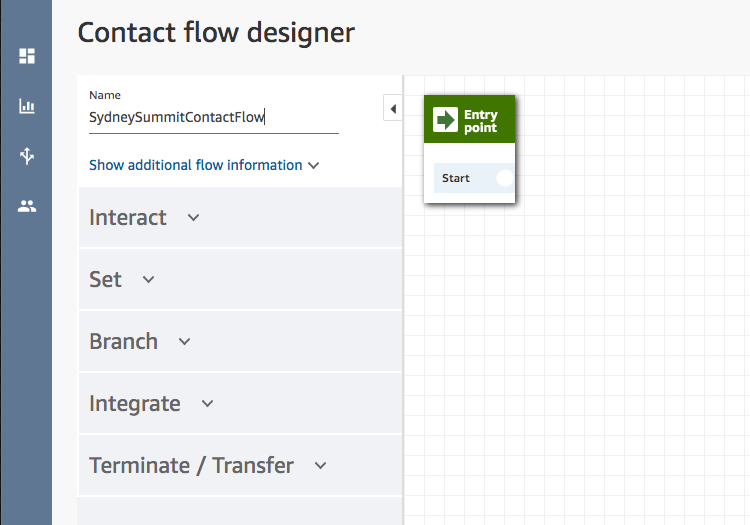

3.	Under **Interact**, drag a **Get customer input** block onto the designer.
4.	Open the **Get customer input** block, and choose **Text to speech (Ad hoc)**, Enter text.
5.	Type a message that provides callers with information about what they can do. For example, use a message that matches the intents used in the bot, such as **“To make an appointment, press or say 1. To check an appointment, press or say 2”**

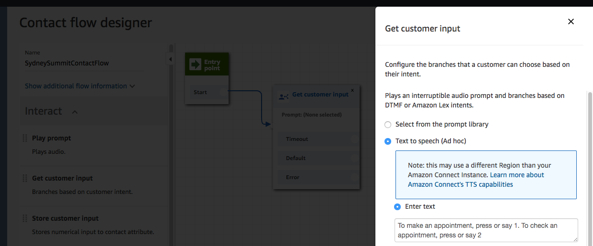

6.	Select Amazon Lex, for name, use **BookAppointment**. For alias, use **BookAppointment**
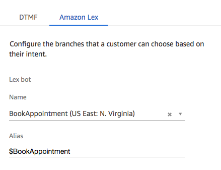
7.	Choose **Add an attribute -> Use attribute**. For type, choose **System**. For Attribute, choose **Customer Number**. For Destination Key, set it as **ContactNumber**. 
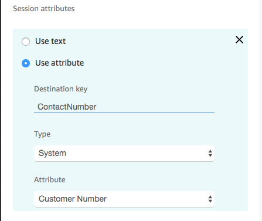

8.	To specify the intents, choose **Add an intent**. Add **BookAppointment** and **CheckAppointment**.
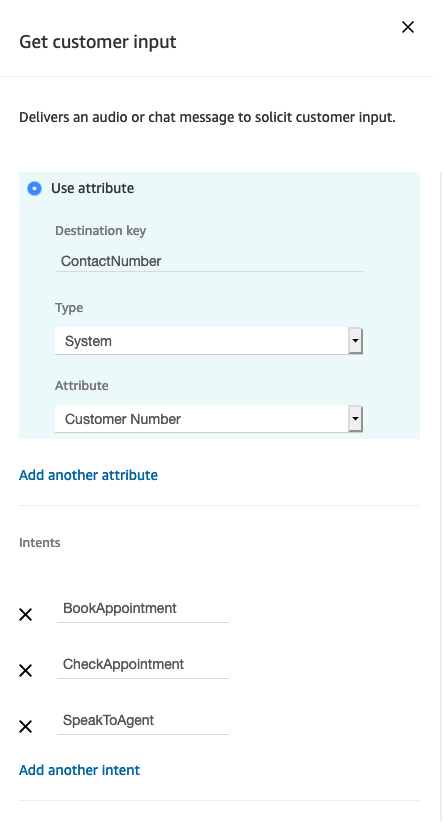

9. Connect **Get customer input** block to the Entry point block.
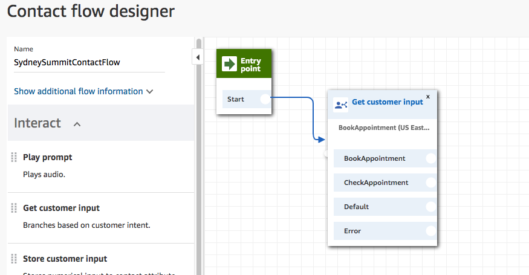

10.	Under **Interact**, drag a Play prompt block onto the designer, and connect it to the **Default** and **Error** from the **Get customer input** block. 
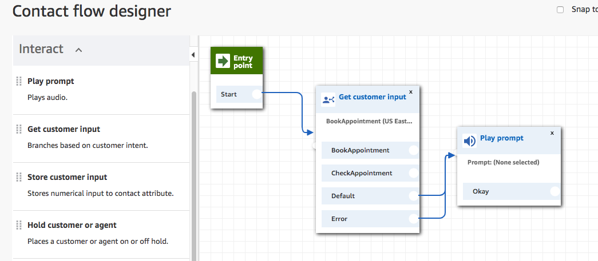

11.	Open the Play prompt block and Text to speech (Ad hoc), Enter text. Type “All of our agents are busy at the moment. Please call again”. Save the block.

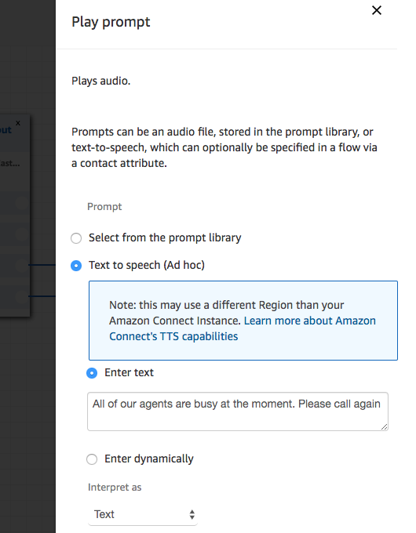

12.	Under **Terminate/Transfer**, drag **Disconnect / hang up**, connect it to the **Play Prompt block** and the **BookAppointment** and **CheckAppointment** intents. 

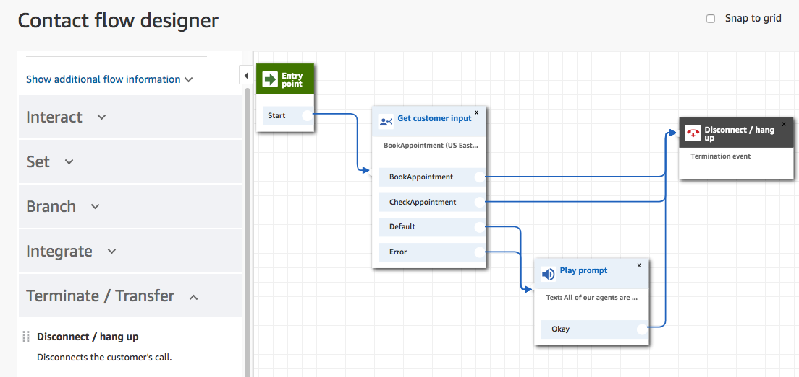

13.	Save and publish the contact flow.

#### Assign the contact flow to a phone number
1.	Open the Amazon Connect Dashboard

2.	Choose View phone numbers.
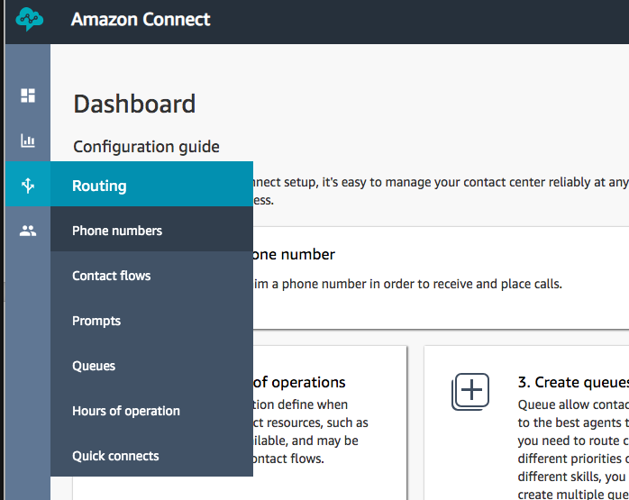

3.	**Claim a number**, select Toll free. Choose country as Australia and any number available

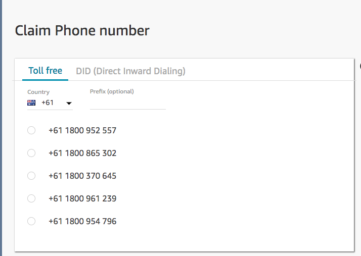

4.	In the **Contact flow/IVR** menu, choose the **SydneySummitContatFlow** flow that you just created.
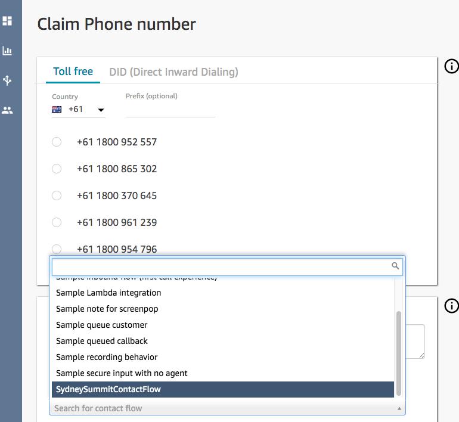

5.	Choose **Save.**

### Try it
Dial the number you claimed above, and follow the prompts.
