# **Build a contact center for booking and checking appointment with AWS Connect/Lex/Lambda**

This lab is provided as part of **[AWS Innovate AI/ML Edition](https://aws.amazon.com/events/aws-innovate/machine-learning/)**, click [here](https://github.com/phonghuule/aws-innovate-ai-ml) to explore the full list of hands-on labs.

ℹ️ You will run this lab in your own AWS account. Please follow directions at the end of the lab to remove resources to avoid future costs.

## **Overview**
In this lab, you will be building a contact center using Amazon Connect and integrating with Amazon Lex. Amazon Lex interprets dual-tone multi-frequency signaling (DTMF) digits entered on a keypad. It matches the intent based on that input in the same way it matches the intent when you speak an utterance. This provides for greater flexibility for customers to interact with your contact center.

At the end of the lab, we will also explore [Contact Lens for Amazon Connect](https://aws.amazon.com/connect/contact-lens/), a feature of Amazon Connect, enables you to better understand the sentiment and trends of customer conversations to identify crucial company and product feedback. 

**Duration:** Approximately 1 hour

## **Architecture**

## **This lab has the following sections:**
- [1. Launch AWS CloudFormation Stack](#1.-launch-cloudformation) 
- [2. Create Lex Chat Bot](#2.-lex-chat-bot) 
- [3. Create Amazon Connect Instance](#3.-create-amazon-connect-instance)
- [4. Amazon Connect Lex Integration](#4.-amazon-connect-lex-integration) 
- [5. Launch calls to test Amazon Connect features](#5.-launch-calls-to-test-amazon-connect-features)
- [6. Clean Up](#6.-clean-up)

## 1. Launch CloudFormation

You will use AWS CloudFormation to deploy an AWS Lambda function in your AWS account. It will be deployed in the **Sydney region**. Please ensure you follow directions at the end of the lab to delete the CloudFormation stack to remove resources.

Amazon Lex is currently available in the N. Virginia, Oregon, Sydney and Ireland regions. Additional regions will be added in future.

**1.1** Login to your AWS account.

**1.2** Right-click this link and open in a new browser tab: [Launch Stack into the Sydney Region with CloudFormation](https://console.aws.amazon.com/cloudformation/home?region=ap-southeast-2#/stacks/new?stackName=LexFunction&templateURL=https://s3-ap-southeast-2.amazonaws.com/huu-shared/aimlinnovate/amazonconnect/connect-lex-integration.yaml)

The CloudFormation console will be displayed, with some information already entered.

**1.3** Click **Next** three times.

**1.4** At the bottom of the page, select "I acknowledge that AWS CloudFormation might create IAM resources".

**1.5** Click **Create stack**.

This will create an AWS Lambda function that you will use with Amazon Lex. There is no need to wait, you can continue with the next steps.

## 2. Lex Chat Bot
### 2.1 Create Chat Bot
You will now create a Lex Chat Bot that will be used to book appointments at a dental surgery. It will be capable of booking appointments for cleaning and whitening, and can also check and cancel appointments.

**2.1.1** In the **Services** menu, click **[Amazon Lex](https://ap-southeast-2.console.aws.amazon.com/lex/home?region=ap-southeast-2#)**.

**2.1.2** Confirm that you are running in the **Sydney** region (shown in the top-right of the console). If a different region is showing, change to **Sydney**.

**2.1.3** Click **Get Started**.

You will be presented with a "Create your bot" page. A number of sample bots are provided, but you will create your own **custom bot**.

**2.1.4** Click **Custom bot**, then configure:

- **Bot name:** `BookAppointment`
- **Output voice:** _Salli_
- **Session timeout:** _5 minutes_
- **COPPA:** _No_

- Click **Create**.

### 2.2. Create Lex Intents

You will now configure the _intents_ for the Lex bot, which are the actions that the user can perform.

#### 2.2.1 Book Appointment Intent.

- Click + near the Intents on the left navigation bar**, then:
- Click **+ Create Intent**
- **Name:** `BookAppointment`
- Click **Add**

#### 2.2.1.1 Create Slot Types

Slot Types are used to define special values that a user will provide. You will create an Appointment Type that will accept pre-defined values.

- In the left navigation pane, beside **Slot types** click ⨁, then:
- Click **Create slot type**
- **Slot type name:** `AppointmentTypeValue`
- **Description:** `Types of Appointments`
- **Values:**
  - `cleaning`
  - `whitening`
- Click **Add slot to Intent**

#### 2.2.1.2 Create Utterances

You will now define utterances, which are spoken or typed phrases that will invoke the intent.

In **Sample utterances**, enter the following phrases (press Enter after each one):

- `I want to book an appointment`
- `Book Appointment`
- `One`

Expand **Lambda initialization and validation**, then:

- Select (turn on) **Initialization and validation code hook**
- **Lambda function:** _lex-connect-book-appointment_
- Click **OK**

This tells Lex to use the AWS Lambda function that you loaded at the start of the lab.

#### 2.2.1.3 Define Slots

You will now define _Slots_, which tell Lex how to interpret user requests.

Create three slots as shown below (click ⨁ to save each one):

Tick **Required** for each of these slots (as shown in the picture).

Under **Fulfillment**:

- Select **AWS Lambda function**
- **Lambda function:** _lex-connect-book-appointment_

Click **Save Intent** (at the bottom of the page).

#### 2.2.2 CheckAppointment Intent

You will create another intend for checking appointments.

In the left navigation pane, beside **Intents** click ⨁, then:

- Click **Create intent**
- **Name:** `CheckAppointment`
- Click **Add**

In **Sample utterances**, enter the following phrases (press Enter after each one):
- `two`
- `check appointment`

Under **Fulfillment**:
- Select **AWS Lambda function**
- **Lambda function:** _lex-connect-book-appointment_
(If a pop-up asks for confirmation of permissions, click **OK**.)

Click **Save Intent** (at the bottom of the page).

#### 2.2.3 SpeakToAgent Intent
You will create another intent to speak to an agent.

In the left navigation pane, beside **Intents** click ⨁, then:

- Click **Create intent**
- **Name:** `SpeakToAgent`
- Click **Add**

In **Sample utterances**, enter the following phrases (press Enter after each one):
- `three`
- `speak to an agent`

In **Response**, add a message that lets callers know that their call is being connected to an agent. For example, “Okay, an agent will be with you shortly.” 

Click **Save Intent** (at the bottom of the page). The SpeakToAgent Intent should look like this: 

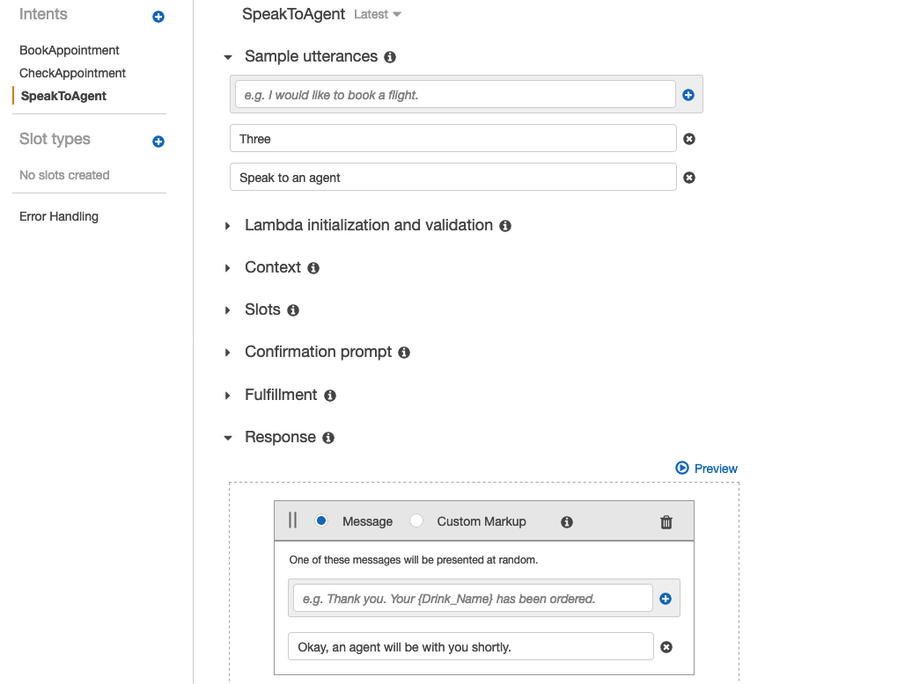

### 2.3 Build and Publish Lex Bot
Click **Build** (in the top-right), then:
- Read the notice
- Click **Build**
- Wait until the build has finished (it will take about 30 seconds)

Click **Publish** (in the top-right), then:
- **Create an alias:** `BookAppointment`
- Click **Publish**
- When it is finished, click **Close**

### 2.4 Test Chat Bot
Test the chat bot to make sure it's working as expected

## 3. Create Amazon Connect Instance

You will now use Amazon Connect to create a virtual contact center. It will use your Lex Bot to interact with callers.

**3.1** In the **Services** menu, select **[Amazon Connect](https://ap-southeast-2.console.aws.amazon.com/connect/home?region=ap-southeast-2)**.

**3.2** Click **Get started**, then configure:
- **Access URL:** Enter your initials and a random number (eg `jb642`)
- Click **Next step**
- **First/Last Name:** Enter your name
- **Username:** `lab-admin`
- **Password:** `ConnectLab1` (you will use this credential to log in later on)
- **Email address:** Enter your email address
- Click **Next step**
- **Incoming calls:** _Yes_
- **Outgoing calls:** _No_
- Click **Next step** twice
- Click **Create instance**

Wait until Amazon Connect finishes creating your virtual contact center.

**3.3** ** Click the **[Amazon Connect AWS console](https://ap-southeast-2.console.aws.amazon.com/connect/home?region=ap-southeast-2)**.

**3.4.** Click the name of your Connect instance in the **Instance Alias** column.

**3.5** In the left navigation pane, click **Contact flows**.

**3.6** Under **Amazon Lex**:
- For **Region**, select **Asia Pacific: Sydney** (which is where you just created the Lex Bot)
- For **Bot**, select **BookAppointment**
- Click **+ Add Lex Bot** (to right right of _BookAppointment_)

Note: It should now display the message "No Lex bots available to add" under the **Bot** field. If this message is _not_ displayed, make sure you clicked the **+ Add Lex Bot** link.

This tells Amazon Connect to use your Lex Bot to interact with users.

**3.7** In the left navigation pane, click **Overview**.

**3.8** Click **Login URL**.

Use the credential in 3.2 to login

## 4.Amazon Connect Lex Integration
You will now configure the call flow that your callers will experience.

**4.1** In the left navigation pop-out menu, choose **Routing -> Contact flows**.

**4.2** Click **Create contact flow**.

**4.3** Click **Enter a name** (in the top-left corner), then enter: `Lex lab`

**4.4** Under **Interact**, drag a **Get customer input** block onto the designer.

**4.5** Click the heading of the **Get customer input** block to display its settings, then:

- Select **Text-to-speech or chat text**
- **Enter text:** `To make an appointment, press or say 1. To check an appointment, press or say 2. Press or say 3 to speak to an agent`

**4.6** Below that, click the **Amazon Lex** heading, then:

- **Select an existing Lex bot:** _BookAppointment_
- **Alias:** `BookAppointment`

- Click **Add an attribute**
- Click **Use attribute**
- **Destination key:** `ContactNumber`
- **Type:** _System_
- **Attribute:** _Customer Number_

- Click **Add an intent** then add `BookAppointment`
- Click **Add another intent** then add `CheckAppointment`
- Click **Add another intent** then add `SpeakToAgent`
- Click **Save**

**4.7** Connect the blocks by dragging a line from **Entry Point - Start** to the **Get customer input** block.

**4.8** Under **Set**, drag a **Set working queue** block onto the designer, then:

- Connect **SpeakToAgent and Default** in **Get customer input** block to **Set working queue** block

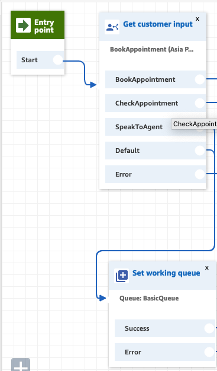

**4.9** Under **Set**, drag a **Set recording and analytics behavior** block onto the designer, then:

- Click on **Set recording and analytics behavior** block and apply settings as follows and **Save**:

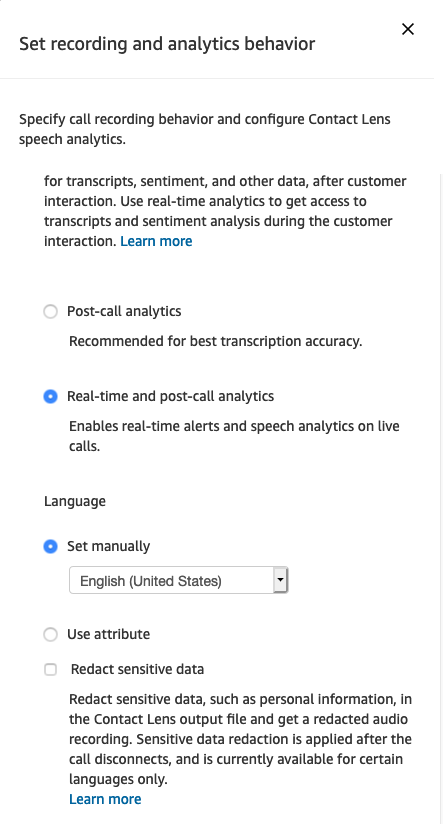

- Connect **Success** in **Set working queue** block to **Set recording and analytics behavior** block

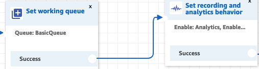

**4.10** Under **Terminate/Transfer**, drag a **Transfer to queue** block onto the designer, then:

- Connect **Success** in **Set recording and analytics behavior** block to **Transfer to queue** block

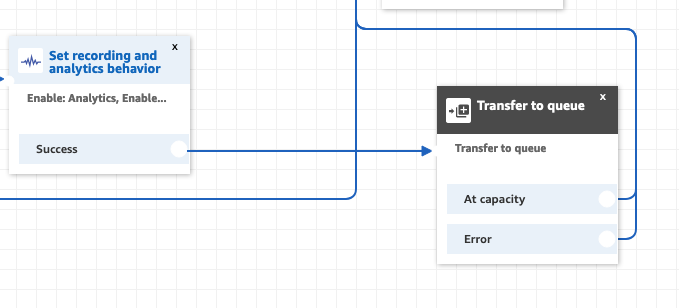

**4.11** Click the title of the **Play prompt** block, then:

- Click **Text-to-speech or chat text**
- **Enter text:** `All of our agents are busy at the moment. Please call again.`
- Click **Save**
- Connect **Error** in **Get customer input** and **Set working queue** blocks to **Play prompt** block
- Connect **Error and At Capacity** in **Transfer to queue** to **Play prompt** block

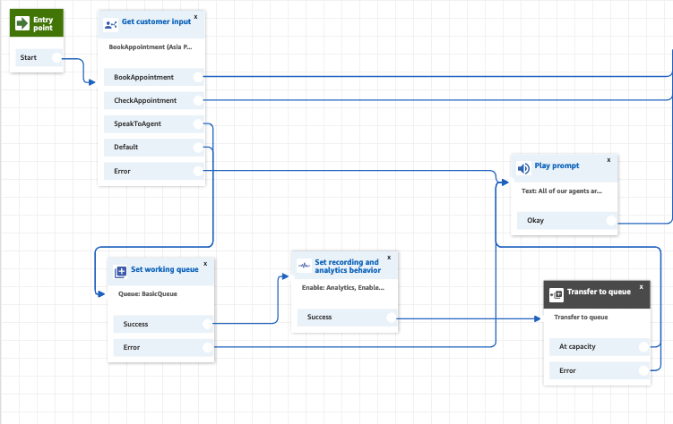

**4.12** On the left, expand **Terminate/Transfer** and drag **Disconnect / hang up** onto the designer, then:

- Connect **BookAppointment and CheckAppointment** in **Get customer input** block and **Play prompt** block to **Disconnect / hang up** block.

The final flow should look like this:
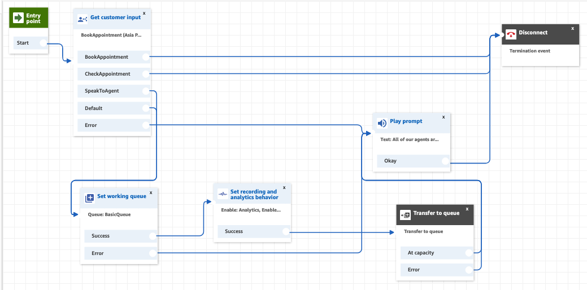

**4.13** Click **Save** (in the top right).

**4.14** Click **Publish**, then click **Publish**.

**4.15** In the left navigation pop-out menu, choose **Routing -> Phone numbers**.

**4.16** Click **Claim a number**

**4.17** Select a phone number in a location of your choice.

**4.18** Towards the bottom of the page, for **Contact flow / IVR** select _Lex Lab_.

**4.19** Click **Save**. It will take a few minutes for the Contact Flow to be effective.

## 5. Launch calls to test Amazon Connect features
Use your phone to call the number you claimed, and follow the prompts. The Lex chatbot will be asissiting with booking appointment and checking appointment. 

### 5.1 Making calls to book and check appointment
- Dial the claimed nummber, press 1 and follow the prompt to make your dental appointment (cleaning/whitening). You should receive an SMS reminder.
- Dial again, press 2 to check the appointment. Amazon Connect recognises your phone number automatically, and look up DynamoDB to retrieve your existing bookings
- In these scenarios, the agent was not required. Instead, the job was done by the Lex Chatbot created by you and integrated to Amazon Connect Contact Flow.

### 5.2 Sentiment Analysis with Amazon Contact Lens
- To test this feature, we need to open **Contact Control Panel** to receive incoming call from your desktop. Click on the icon on the top right corner to log in and grant permissions such as Sound and Microphone

Remember to set the staus as Available

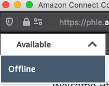

- Dial the claimed nummber, press 3 to talk to an agent. You would see an incoming call in **Contact Control Panel**. Accept the call, Let's assume that you are talking to an agent, and provide some feedbacks (both negative and positive) and end the call.

- Now, let's try to understand the sentiment of the call the agent has just received. 

- Go to **Contact Search** on the left navigation panel
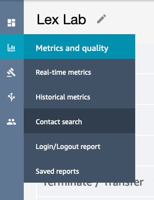

- You will see the previous calls on the list with recording, timestamp, etc...
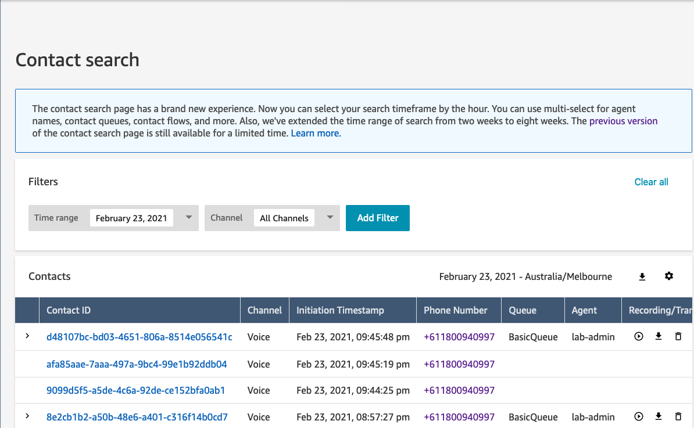

- Click on the **Contact ID** to analyze the call. In my case, i gave positive feedback at the beginning of the call and then negetive, so the sentiment trend analyzed is as follows:
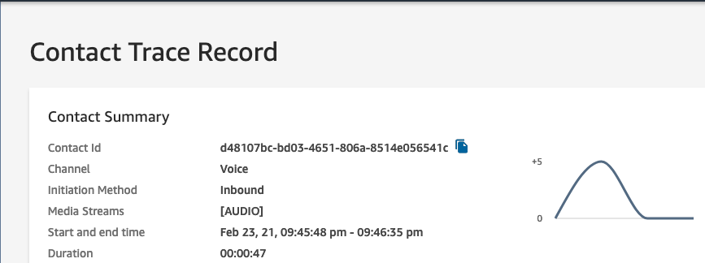

- See how easy sentiment analysis was done. Check out what else can be done with [Contact Lens for Amazon Connect](https://aws.amazon.com/connect/contact-lens/)

## 6. Clean Up

Once you have finished testing the lab, follow these instructions to delete the resources from your AWS account. **This will avoid any future costs for the services uses.**

**6.1** To release the number you claimed:

- Select the phone number and click **Release**

**6.2** Close the Amazon Lex administrator browser tab (with the blue cloud icon)

**6.3.** Return to the Amazon Connect management console browser tab (with the orange cube icon), then:

- In the left navigation pane, click **Amazon Connect** (above _Overview_)
- Select (tick) the Instance Alias (tick the box, do not click the link)
- Click **Remove**
- You will be asked to type the name of your instance to confirm deletion

**6.4.** In the **Services** menu, select **Amazon Lex**.

**6.5.** Click **BookAppointment**, then:

- Click the **Settings** tab
- Delete ⨂ the _BookAppointment_ alias

**6.6.** Click the left arrow in the top-left corner to return to the Lex dashboard.

**6.7** Click the   ⃝ circle beside **BookAppointment**, then:

- In the **Actions** menu, click **Delete**
- Click **Continue**

**6.8** In the left navigation pane, click **Intents**, then:

- Delete all intents

**6.9** In the left navigation pane, click **Slot types**, then:

- Delete the displayed slot type

**6.10** In the **Services** menu, select **CloudFormation**, then:

- Delete the **LexFunction** stack.

## Survey
Please help us to provide your feedback [here](https://amazonmr.au1.qualtrics.com/jfe/form/SV_b7mXqfAaiIZUnn8?Session=Lab2).
Participants who complete the surveys from AWS Innovate Online Conference - AI & Machine Learning Edition will receive a gift code for USD25 in AWS credits. AWS credits will be sent via email by 31 March, 2021.s