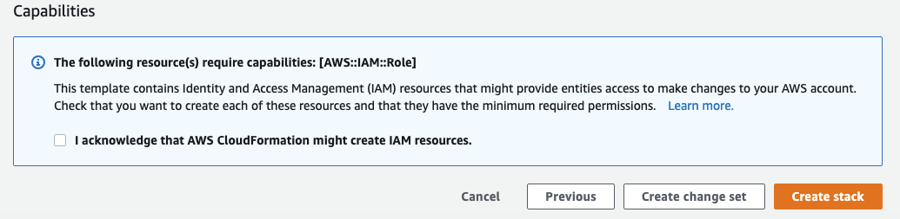

# **Build a contact center for booking and checking appointment with AWS Connect/Lex/Lambda**

This lab is provided as part of **[AWS Summit Online!](https://aws.amazon.com/events/summits/online/)**.

ℹ️ You will run this lab in your own AWS account. Please follow directions at the end of the lab to remove resources to avoid future costs.

## **Overview**
In this lab, you will be building a contact center using Amazon Connect and integrating with Amazon Lex. Amazon Lex interprets dual-tone multi-frequency signaling (DTMF) digits entered on a keypad. It matches the intent based on that input in the same way it matches the intent when you speak an utterance. This provides for greater flexibility for customers to interact with your contact center.

**Duration:** Approximately 1 hour

## **Architecture**

**Overview**

- Launch AWS CloudFormation Stack
- Create Lex Chat Bot
- Create Amazon Connect Instance
- Amazon Connect Lex Integration

## Setup: Launch AWS CloudFormation Stack

You will use AWS CloudFormation to deploy an AWS Lambda function in your AWS account. It will be deployed in the **Sydney region**. Please ensure you follow directions at the end of the lab to delete the CloudFormation stack to remove resources.

Amazon Lex is currently available in the N. Virginia, Oregon, Sydney and Ireland regions. Additional regions will be added in future.

**1.** Login to your AWS account.

**2.** Right-click this link and open in a new browser tab: [Launch Stack into the Sydney Region with CloudFormation](https://console.aws.amazon.com/cloudformation/home?region=ap-southeast-2#/stacks/new?stackName=LexFunction&templateURL=https://s3-ap-southeast-2.amazonaws.com/share.jr-class.net/lex-connect-book-appointment.yaml)

The CloudFormation console will be displayed, with some information already entered.

**3.** Click **Next** three times.

**4.** At the bottom of the page, select "I acknowledge that AWS CloudFormation might create IAM resources".

**5.** Click **Create stack**.

This will create an AWS Lambda function that you will use with Amazon Lex. There is no need to wait, you can continue with the next steps.

## Part 1: Create Lex Chat Bot

You will now create a Lex Chat Bot that will be used to book appointments at a dental surgery. It will be capable of booking appointments for cleaning and whitening, and can also check and cancel appointments.

**6.** In the **Services** menu, click **Amazon Lex**.

**7.** Confirm that you are running in the **Sydney** region (shown in the top-right of the console). If a different region is showing, change to **Sydney**.

**8.** Click **Get Started**.

You will be presented with a "Create your bot" page. A number of sample bots are provided, but you will create your own custom bot.

**9.** Click **Custom bot**, then configure:

- **Bot name:** `BookAppointment`
- **Output voice:** _Salli_
- **Session timeout:** _5 minutes_
- **COPPA:** _No_

- Click **Create**.

### Create Lex Intent

You will now configure the _intents_ for the Lex bot, which are the actions that the user can perform.

The first intent is for users to book an appointment.

**10.** Click **+ Create Intent**, then:

- Click **Create Intent**
- **Name:** `BookAppointment`
- Click **Add**

### Create Slot Types

Slot Types are used to define special values that a user will provide. You will create an Appointment Type that will accept pre-defined values.

**11.** In the left navigation pane, beside **Slot types** click ⨁, then:

- Click **Create slot type**
- **Slot type name:** `AppointmentTypeValue`
- **Description:** `Types of Appointments`
- **Values:**
  - `cleaning`
  - `whitening`
- Click **Save slot type**

### Create Utterances

You will now define utterances, which are spoken or typed phrases that will invoke the intent.

**12.** In **Sample utterances**, enter the following phrases (press Enter after each one):

- `I want to book an appointment`
- `Book Appointment`
- `One`

**13.** Expand **Lambda initialization and validation**, then:

- Select (turn on) **Initialization and validation code hook**
- **Lambda function:** _lex-connect-book-appointment_
- Click **OK**

This tells Lex to use the AWS Lambda function that you loaded at the start of the lab.

You will now define _Slots_, which tell Lex how to interpret user requests.

**14.** Create three slots as shown below (click ⨁ to save each one):

**15.** Select (turn on) **Required** for each of these slots (as shown in the picture).

**16.** Under **Fulfillment**:

- Select **AWS Lambda function**
- **Lambda function:** _lex-connect-book-appointment_

**17.** Click **Save Intent** (at the bottom of the page).

### Create CheckAppointment Intent

You will create another intend for checking appointments.

**18.** In the left navigation pane, beside **Intents** click ⨁, then:

 - Click **Create intent**
- **Name:** `CheckAppointment`
- Click **Add**

**19.** In **Sample utterances**, enter the following phrases (press Enter after each one):

- `two`
- `check appointment`

**20.** Under **Fulfillment**:

- Select **AWS Lambda function**
- **Lambda function:** _lex-connect-book-appointment_

(If a pop-up asks for confirmation of permissions, click **OK**.)

**21.** Click **Save Intent** (at the bottom of the page).

### Build and Publish Lex Bot

**22.** Click **Build** (in the top-right), then:

- Read the notice
- Click **Build**
- Wait until the build has finished (it will take about 30 seconds)

**23.** Click **Publish** (in the top-right), then:

- **Create an alias:** `BookAppointment`
- Click **Publish**
- When it is finished, click **Close**

**24.** Expand the **Test Chatbot** panel (on the very right).

**25.** Try having a conversation with your bot, such as:

- `Book appointment`
- Pick a Date and a timeslot (if there is no availability, try the other days)

## Create Amazon Connect Instance

You will now use Amazon Connect to create a virtual contact center. It will use your Lex Bot to interact with callers.

**26.** In the **Services** menu, select **Amazon Connect**.

**27.** Click **Get started**, then configure:

- **Access URL:** Enter your initials and a random number (eg `jb642`)
- Click **Next step**
- **First/Last Name:** Enter your name
- **Username:** `lab-admin`
- **Password:** `ConnectLab1`
- **Email address:** Enter your email address
- Click **Next step**
- **Incoming calls:** _Yes_
- **Outgoing calls:** _No_
- Click **Next step** twice
- Click **Create instance**

Wait until Amazon Connect finishes creating your virtual contact center.

**28.** Click the **Amazon Connect AWS console** link at the very bottom of the page.

**29.** Click the name of your Connect instance in the **Instance Alias** column.

**30.** In the left navigation pane, click **Contact flows**.

**31.** Under **Amazon Lex**:

- For **Region**, select **Asia Pacific: Sydney** (which is where you just created the Lex Bot)
- For **Bot**, select **BookAppointment**
- Click **+ Add Lex Bot** (to right right of _BookAppointment_)

Note: It should now display the message "No Lex bots available to add" under the **Bot** field. If this message is _not_ displayed, make sure you clicked the **+ Add Lex Bot** link.

This tells Amazon Connect to use your Lex Bot to interact with users.

**32.** In the left navigation pane, click **Overview**.

**33.** Click **Login as Administrator**.

You will now configure the call flow that your callers will experience.

**34.** In the left navigation pop-out menu, choose **Routing -> Contact flows**.

**35.** Click **Create contact flow**.

**36.** Click **Enter a name** (in the top-left corner), then enter: `Lex lab`

**37.** Under **Interact**, drag a **Get customer input** block onto the designer.

**38.** Click the heading of the **Get customer input** block to display its settings, then:

- Select **Text-to-speech or chat text**
- **Enter text:** `To make an appointment, press or say 1. To check an appointment, press or say 2`

**39.** Below that, click the **Amazon Lex** heading, then:

- **Select an existing Lex bot:** _BookAppointment_
- **Alias:** `BookAppointment`

- Click **Add an attribute**
- Click **Use attribute**
- **Destination key:** `ContactNumber`
- **Type:** _System_
- **Attribute:** _Customer Number_

- Click **Add an intent** then add `BookAppointment`
- Click **Add another intent** then add `CheckAppointment`
- Click **Save**

**40.** Connect the blocks by dragging a line from **Entry Point - Start** to the **Get customer input** block.

**41.** Under **Interact**, drag a **Play prompt** block onto the designer, then:

- Connect **Default** to **Play Prompt**
- Connect **Error** to **Play Prompt**

**42.** Click the title of the **Play prompt** block, then:

- Click **Text-to-speech or chat text**
- **Enter text:** `All of our agents are busy at the moment. Please call again.`
- Click **Save**

**43.** On the left, expand **Terminate/Transfer** and drag **Disconnect / hang up** onto the designer, then:

- Connect it to the other blocks as shown:

**44.** Click **Save** (in the top right).

**45.** Click **Publish**, then click **Publish**.

### Assign the contact flow to a phone number

**46.** In the left navigation pop-out menu, choose **Routing -> Phone numbers**.

**47.** Click **Claim a number**

**49.** Select a phone number in a location of your choice.

**50.** Towards the bottom of the page, for **Contact flow / IVR** select _Lex Lab_.

**51.** Click **Save**. It will take a few minutes for the Contact Flow to be effective.

### Try it!

Use your phone to call the number you claimed, and follow the prompts.

- Make an appointment. You should receive an SMS reminder.
- Call again, then check the appointment. Connect recognises your phone number automatically.

## Clean Up

Once you have finished testing the lab, follow these instructions to delete the resources from your AWS account. **This will avoid any future costs for the services uses.**

**52.** To release the number you claimed:

- Select the phone number and click **Release**

**53.** Close the Amazon Lex administrator browser tab (with the blue cloud icon)

**54.** Return to the Amazon Connect management console browser tab (with the orange cube icon), then:

- In the left navigation pane, click **Amazon Connect** (above _Overview_)
- Select (tick) the Instance Alias (tick the box, do not click the link)
- Click **Remove**
- You will be asked to type the name of your instance to confirm deletion

**55.** In the **Services** menu, select **Amazon Lex**.

**56.** Click **BookAppointment**, then:

- Click the **Settings** tab
- Delete ⨂ the _BookAppointment_ alias

**57.** Click the left arrow in the top-left corner to return to the Lex dashboard.

**58.** Click the   ⃝ circle beside **BookAppointment**, then:

- In the **Actions** menu, click **Delete**
- Click **Continue**

**59.** In the left navigation pane, click **Intents**, then:

- Delete both intents

**60.** In the left navigation pane, click **Slot types**, then:

- Delete the displayed slot type

**61.** In the **Services** menu, select **CloudFormation**, then:

- Delete the **LexFunction** stack.
